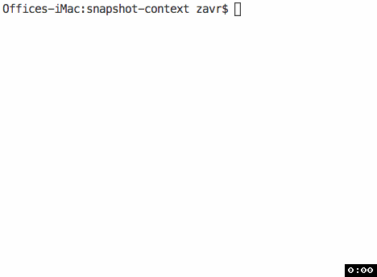
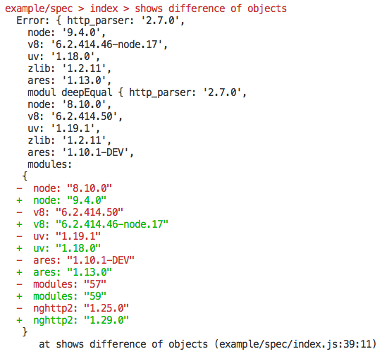

# snapshot-context

`snapshot-context` is an Art Deco Node.js npm package.

A context for zoroaster which enables snapshot testing.

## `import snapshotContext from 'snapshot-context'`

The snapshot context should be passed in to a [`Zoroaster` test suite][2] in the `context` property.

```js
import { fork } from 'spawncommand'
import context from '../context'
import snapshotContext from 'snapshot-context'
// import types
import { Context } from '../context' // eslint-disable-line
import { SnapshotContext } from 'snapshot-context' // eslint-disable-line

/** @type {Object.<string, (ctx: Context, snapshotCtx: SnapshotContext)>} */
const T = {
  context:[
    context,
    snapshotContext,
  ],
  async 'produces correct output'({ TEST_SUITE_PATH }, { test, setDir }) {
    setDir(SNAPSHOT_DIR)
    const { promise } = fork(BIN, [TEST_SUITE_PATH, '--babel'], {
      stdio: 'pipe',
    })
    const { stdout } = await promise
    await test('integration-stdout.txt', s)
  },
}

export default T
```

## API

There are a set of methods made available by the api.

### setDir(path:string)

Sets the root directory to save to and read snapshots from. Otherwise, an absolute path to the file can be passed.

```js
import { resolve } from 'path'
import snapshotContext, { SnapshotContext } from 'snapshot-context' // eslint-disable-line
import erte from '../../src' // tested lib

const SNAPSHOT_DIR = resolve(__dirname, '../snapshot')

const stringContext = {
  /**
   * A string with 1 new line
   */
  s: 'I am all in a sea of wonders.\nI doubt;\nI fear;\n',
  /**
   * A string with 2 new lines
   */
  t: 'I am all in a sea of wonders.\n\nI doubt;\n\nI fear;\n\n',
}

/** @type {Object.<string, (ctxString: stringContext ctx: SnapshotContext)>} */
const T = {
  context: [
    function () {
      Object.assign(this, stringContext)
    },
    snapshotContext,
  ],
  async 'replaces new lines'({ s, t }, { setDir, test }) {
    setDir(SNAPSHOT_DIR)
    const res = erte(s, t)
    await test('new-lines.txt', res)
  },
  // absolute path without set-dir
  async 'replaces reverse new lines'({ s, t }, { test }) {
    const res = erte(t, s)
    const path = resolve(SNAPSHOT_DIR, 'new-lines-reverse.txt')
    await test(path, res)
  },
}

export default T
```

### async test(path:string, actual: string|object)

Test whether a snapshot matches the one saved in the path. An equality of strings is asserted, and objects are deep-equal tested. Objects are serialised as `JSON` for writing, and back when reading.

 - If there's no snapshot file existing, the user is prompted to answer the `save snapshot` question with a `y` to confirm new snapshot.
 - The path to the file will be ensured, so that all directories in the path are made.
 - The error stack will start at the point where `test` is called.



The difference between objects will be shown using `deepEqual` from the `assert-diff`



The difference between strings will be highlighted with `erte`.


---

(c) [artdecocode][1] 2018

[1]: https://artdeco.bz
[1]: https://zoroaster.co.uk/#test-suite
